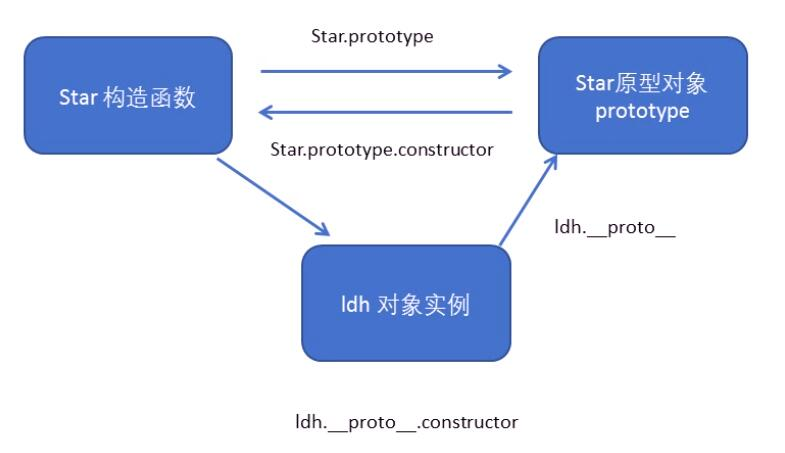

## 构造函数和原型

#### 构造函数

构造函数通过原型分配的行数是所有对象所`共享的`

JS规定，每一个构造函数都有一个 `prototype` 属性，指向另一个对象，注意这个prototype就是一个对象，这个对象的所有属性和方法都会被构造函数所拥有。

我们把那些不变的方法直接定义在prototype对象上，这样所有对象的实例就可以共享这些方法。

- 原型是什么？

  *一个对象，我们也称prototype为原型对象，每个构造函数都有*

- 原型的作用是什么？

  *共享方法*

一般情况下，我们的公共属性定义在构造函数里面，公共的方法放到原型对象上。

```
function Star(name, age) {
  this.name = name;
  this.age = age;
}

Star.prototype.sing = function() {
  console.log('我会唱歌');
}

var ldh = new Star('刘德华', 18);
var zxy = new Star('张学友', 19);
console.log(ldh.sing === zxy.sing); // true
ldh.sing();
console.log(ldl.__proto__ === Star.prototype); // true
```
#### 实例对象

构造函数生成的实例对象有一个属性 `__proto__` , 指向其构造函数的原型对象 `prototype`

所以实例对象的 `__proto__` 和构造函数的 `prototype` 是等价的。

实例对象方法和属性查找规则： 先在对象自己身上找，没有再去构造函数的prototype上及原型链上找。

#### constructor

对象原型（__proto__）和构造函数的原型对象（prototype）里面都有一个属性`constructor`属性, constructor我们称为构造函数，因为它指回构造函数本身。

constructor主要用于记录该对象引用于哪个构造函数，它可以让原型对象重新指向原来的构造函数。
```
Star.prototype = {
  constructor: Star,
  sing: function() {
    console.log('唱歌')
  },
  dance: funciton() {
    console.log('跳舞')
  }
}
```

#### 构造函数，原型对象以及实力对象的关系



#### this指向

1. 在构造函数中，this指向的是实例对象。

2. 原型对象prototype的函数中，this指向实例对象。
