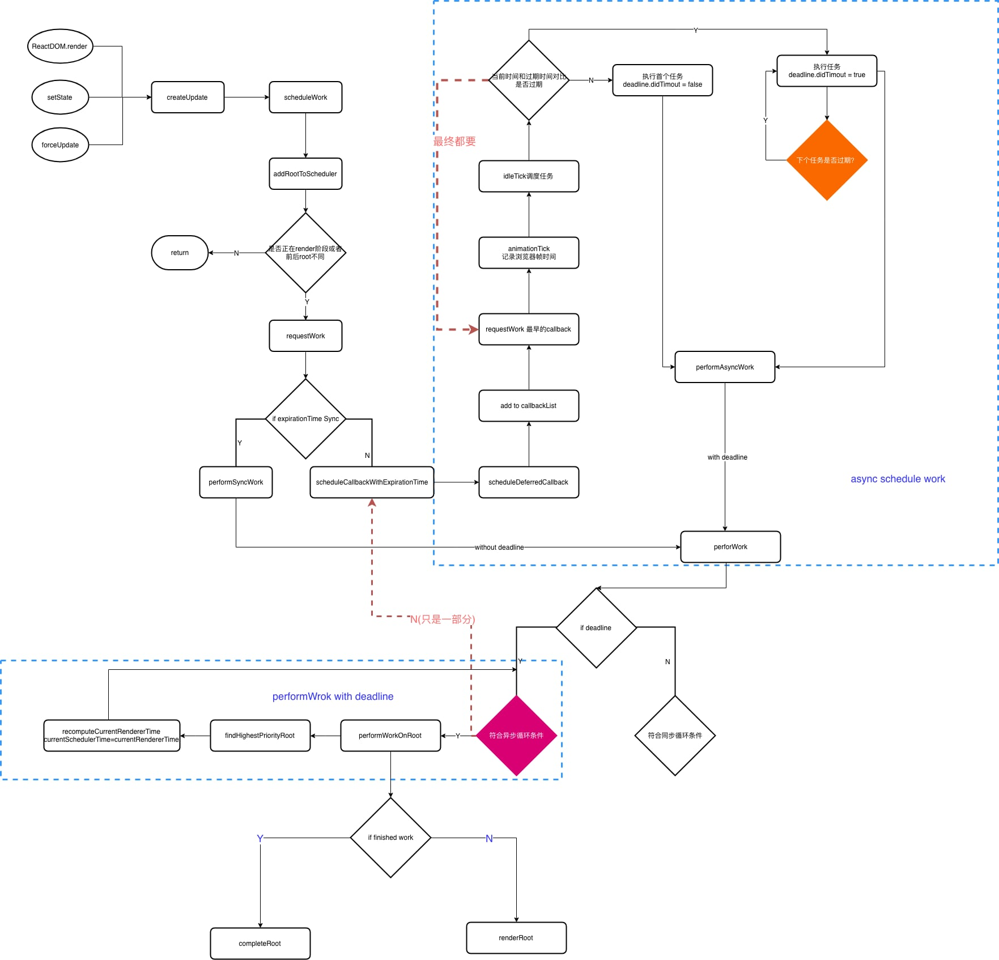

## 任务调度

任务调度图解：



源码在 react-reconciler 下的 ReactFiberScheduler.js 内：

##### scheduleWork:
```
function scheduleWork(fiber: Fiber, expirationTime: ExpirationTime) {
    // 更新Fiber及所有子树的expirationTime，
    // 返回FiberRoot
  const root = scheduleWorkToRoot(fiber, expirationTime);
  if (root === null) {
    // 去掉__DEV__代码
    return;
  }
  if (
    !isWorking &&
    nextRenderExpirationTime !== NoWork &&
    expirationTime > nextRenderExpirationTime
  ) {
    // This is an interruption. (Used for performance tracking.)
    interruptedBy = fiber;
    // 优先执行高优先级的任务
    resetStack();
  }
  markPendingPriorityLevel(root, expirationTime);
  if (
    // If we're in the render phase, we don't need to schedule this root
    // for an update, because we'll do it before we exit...
    !isWorking ||
    isCommitting ||
    // ...unless this is a different root than the one we're rendering.
    nextRoot !== root
  ) {
    const rootExpirationTime = root.expirationTime;
    requestWork(root, rootExpirationTime);
  }
  if (nestedUpdateCount > NESTED_UPDATE_LIMIT) {
    // Reset this back to zero so subsequent updates don't throw.
    // 防止更新中修改state,无限循环进入更新
    nestedUpdateCount = 0;
    invariant(
      false,
      'Maximum update depth exceeded. This can happen when a ' +
        'component repeatedly calls setState inside ' +
        'componentWillUpdate or componentDidUpdate. React limits ' +
        'the number of nested updates to prevent infinite loops.',
    );
  }
}
```

##### requestWork:

- 加入到root调度队列
- 判断是否批量更新
- 根据expirationTime判断调度类型

```
function requestWork(root: FiberRoot, expirationTime: ExpirationTime) {
  // 处理firstScheduledRoot,lastScheduledRoot,root的expirationTime
  addRootToSchedule(root, expirationTime);
  if (isRendering) {
    // 已经开始
    return;
  }
  if (isBatchingUpdates) {
    // Flush work at the end of the batch.
    if (isUnbatchingUpdates) {
      // ...unless we're inside unbatchedUpdates, in which case we should
      // flush it now.
      nextFlushedRoot = root;
      nextFlushedExpirationTime = Sync;
      performWorkOnRoot(root, Sync, false);
    }
    return;
  }
  // TODO: Get rid of Sync and use current time?
  if (expirationTime === Sync) {
    performSyncWork();
  } else {
    scheduleCallbackWithExpirationTime(root, expirationTime);
  }
}
```

setState 是同步的还是异步的？

setState本身的方法调用是同步的，但是调用setState并不标志着React的state立马就更新了，这个更新是要根据我们当前的执行环境的上文来判断的如果处于`isBatchingUpdates`环境下不会同步更新的，另还有异步更新调度也不会同步更新。

##### scheduler包（被提到与react-reconciler同级的目录）:

- 维护时间片
- 模拟requestIdleCallback(等浏览器把要做的事做完后来调取回调)
- 调度列表和超时判断

主要用到的方法：
> 1

```
function scheduleCallbackWithExpirationTime(root: FiberRoot, expirationTime: ExpirationTime,){}
```

异步进行root任务调度就是通过这个方法来做的，这里最主要的就是调用了scheduler的scheduleDeferredCallback方法（在scheduler包中是scheduleWork）

传入的的是回调函数performAsyncWork，以及一个包含timeout超时事件的对象

> 2

```
function unstable_scheduleCallback(callback, deprecated_options){}
```

创建一个调度节点newNode，并按照timoutAt的顺序加入到CallbackNode链表，调用ensureHostCallbackIsScheduled

这里面的expirationTime是调用时传入的timeoutAt加上当前时间形成的过期时间。

> 3

```
function ensureHostCallbackIsScheduled(){}
```

如果已经在调用回调了，就 return，因为本来就会继续调用下去，isExecutingCallback在flushWork的时候会被修改为true

如果isHostCallbackScheduled为false，也就是还没开始调度，那么设为true，如果已经开始了，就直接取消，因为顺序可能变了。

调用requestHostCallback开始调度

> 4

```
requestHostCallback = function(callback, absoluteTimeout){}
```

开始进入调度，设置调度的内容，用scheduledHostCallback和timeoutTime这两个全局变量记录回调函数和对应的过期时间

调用requestAnimationFrameWithTimeout，其实就是调用requestAnimationFrame在加上设置了一个100ms的定时器，防止requestAnimationFrame太久不触发。

调用回调animtionTick并设置isAnimationFrameScheduled全局变量为true

> 5

```
var animationTick = function(rafTime) {}
```

只要scheduledHostCallback还在就继续调要requestAnimationFrameWithTimeout因为这一帧渲染完了可能队列还没情况，本身也是要进入再次调用的，这边就省去了requestHostCallback在次调用的必要性

接下去一段代码是用来计算相隔的requestAnimationFrame的时差的，这个时差如果连续两次都小鱼当前的activeFrameTime，说明平台的帧率是很高的，这种情况下会动态得缩小帧时间。

最后更新frameDeadline，然后如果没有触发idleTick则发送消息

> 6

```
window.addEventListener('message', idleTick, false)

var idleTick = function(event) {}
```

首先判断postMessage是不是自己的，不是直接返回

清空scheduledHostCallback和timeoutTime

获取当前时间，对比frameDeadline，查看是否已经超时了，如果超时了，判断一下任务callback的过期时间有没有到，如果没有到，则重新对这个callback进行一次调度，然后返回。如果到了，则设置didTimeout为true

接下去就是调用callback了，这里设置isFlushingHostCallback全局变量为true代表正在执行。并且调用callback也就是flushWork并传入didTimeout

> 7

```
function flushWork(didTimeout) {}
```

先设置isExecutingCallback为true，代表正在调用callback

设置deadlineObject.didTimeout，在 React 业务中可以用来判断任务是否超时

如果didTimeout，会一次从firstCallbackNode向后一直执行，知道第一个没过期的任务

如果没有超时，则依此执行第一个callback，知道帧时间结束为止

最后清理变量，如果任务没有执行完，则再次调用ensureHostCallbackIsScheduled进入调度

顺便把Immedia优先级的任务都调用一遍。

> 8

```
 function flushFirstCallback() {}
```

如果当前队列中只有一个回调，清空队列

调用回调并传入deadline对象，里面有timeRemaining方法通过frameDeadline - now()来判断是否帧时间已经到了

如果回调有返回内容，把这个返回加入到回调队列

##### performWork:


